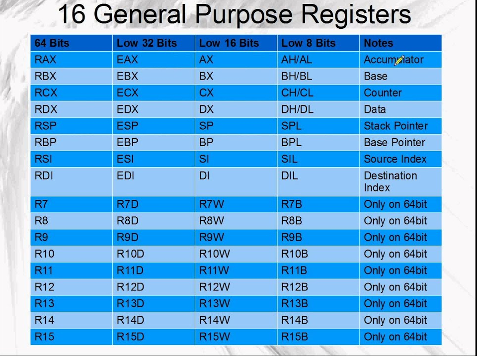
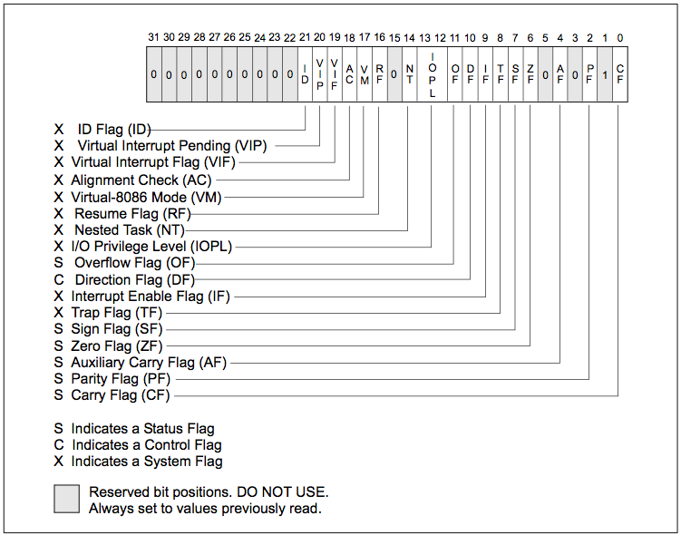

# Architecture Details

## 1. [x86](https://en.wikipedia.org/wiki/X86) and [x64](https://en.wikipedia.org/wiki/X86-64) architecture
This is the most popular Architecture in computer market and uses the [complex instruction architecture](https://en.wikipedia.org/wiki/Complex_instruction_set_computer).The x86 architecture uses 32 bit address space which also means that each instruction can process 32 bit of data in each clock cycle [more on this here]().The x64 arch is merely the extension of the x86 arch using the 64 bit addressing.

## Registers 
### 1. General Purpose Registers 
The x86 architecture have 8 general purpose registers while the x64 one has 16 of them. Which can be categorized as 
#### Data registers  
* _AX_ :- Aka Accumulator register used to store the return value for any function.  
* _BX_ :- Aka Base register which used in indexed addressing.  
* _CX_ :- AKA Count register used to store the loop count in iterative operations.
* _DX_ :- AKA Data register used to store the higher 32 bits to return 64 bit value from function. 
#### Index registers
* _SI_ :- AKA Source Index register
* _DI_ :- AKA Destination Index register
#### Pointer registers
* _IP_ :- AKA Instruction pointer and used to store the next instruction to be executed this register is used to dictate the control flow of the program. and hence for security this register cannnot be accessed directly.  
* _BP_ :- AKA Base pointer and is used to point at the base of the stack. which can be manipulated in order to create new stack and also to offset the local variables frames that allowed the complex tasks like recursion. 
* _SP_ :- AKA Stack pointer this points to the top of the stack this can be used to know the top of the stack and this can be manipulated directly to discard some value or to save some space for the local variables.    

> In x86 architecture the name of all these registers are prefixed with E for extended as the 32 bit architecture extended from the 16 bit one .

> similarly the x64 architecture uses the prefix R which stands for Register :joy: .The remaining 8 registers are named _R8_  to _R15_.

  

### 2. Control registers 
Although listed as the pointer register the IP or instruction pointer is more of a control register than just a pointer register. Except this the there are also the flag registers which can control the execution flow of the programs.  
These flags register are modified as the side effect to the other mathematical and logical operations .

