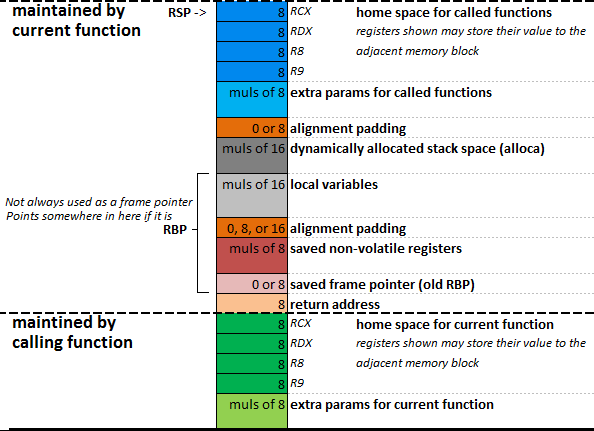

# Architecture Details

## 1. [x86](https://en.wikipedia.org/wiki/X86) and [x64](https://en.wikipedia.org/wiki/X86-64) architecture
This is the most popular Architecture in computer market and uses the [complex instruction architecture](https://en.wikipedia.org/wiki/Complex_instruction_set_computer).The x86 architecture uses 32 bit address space which also means that each instruction can process 32 bit of data in each clock cycle [more on this here](https://www.techopedia.com/definition/289/32-bit).The x64 arch is merely the extension of the x86 arch using the 64 bit addressing.

## Registers 
### 1. General Purpose Registers 
The x86 architecture have 8 general purpose registers while the x64 one has 16 of them. Which can be categorized as 
#### Data registers  
* _AX_ :- Aka Accumulator register used to store the return value for any function.  
* _BX_ :- Aka Base register which used in indexed addressing.  
* _CX_ :- AKA Count register used to store the loop count in iterative operations.
* _DX_ :- AKA Data register used to store the higher 32 bits to return 64 bit value from function. 
#### Index registers
* _SI_ :- AKA Source Index register
* _DI_ :- AKA Destination Index register
#### Pointer registers
* _IP_ :- AKA Instruction pointer and used to store the next instruction to be executed this register is used to dictate the control flow of the program. and hence for security this register cannnot be accessed directly.  
* _BP_ :- AKA Base pointer and is used to point at the base of the stack. which can be manipulated in order to create new stack and also to offset the local variables frames that allowed the complex tasks like recursion. 
* _SP_ :- AKA Stack pointer this points to the top of the stack this can be used to know the top of the stack and this can be manipulated directly to discard some value or to save some space for the local variables.    

> In x86 architecture the name of all these registers are prefixed with E for extended as the 32 bit architecture extended from the 16 bit one .

> similarly the x64 architecture uses the prefix R which stands for Register :joy: .The remaining 8 registers are named _R8_  to _R15_.

  

### 2. Control registers 
Although listed as the pointer register the IP or instruction pointer is more of a control register than just a pointer register. Except this the there are also the flag registers which can control the execution flow of the programs.  
These flags register are modified as the side effect to the other mathematical and logical operations .

  

## [Stack](https://en.wikipedia.org/wiki/Call_stack)  
This is a certain space in computer memory space which serves as temprorary space for local variables and also to save register state to restore their value later during execution the stack allows for the return oriented programming and also the concept of the stack frame which is the foremost requirement for the recursive functions.  
This is a last in first out data space. The stack is usually aligned to 4 bytes or 16 bytes boundries using some padding.since the cpu is faster at accessing data at these boundary level.  
In x86 or x64  _push_ and _pop_ instructions are used to put data into the stack and remove data from the stack respectively.The stack grows from higher address space to the lower address space.
The assembly programming is almost about manipulating the registers and the stack.

## [function calls and stackframes](https://en.wikipedia.org/wiki/X86_calling_conventions)
The code execution starts with the address of the enrty point being loaded into the _EIP_ register .After this whenever some instruction is exeuted the _EIP_ is updated to point at the next instruction to be executed. So when ever a function is to be called the calling module saves the address of the next instruction as return address into the stack (Pushes it) and then updates the _EIP_ to point to the address of the first instruction of the called function.
> __NOTE:__  
As we know  that the _EIP_ register cannot be modified directly this task is done implicitly by using the _call_ instruction in x86 or x64 architecture.

However before calling the function the calling also has to take care of two things :  
### Saving the register states
The calling module is allowed to assume that only certain registers are not modified by the called function while the rest of them are modified so if the calling modules cares it needs to save these registers hence are called the __caller saved registers AKA Volatile Registers__.  
And since the caller is allowed to believe that the callee wont change certain registers the callee must save the value in these registers and restore their value before returning the control the caller.
These are called the __callee saved registers AKA non-Volatile Registers__.

| caller saved | callee saved |  
|:-------------:|:-----------:|
| _EAX_         |   _EDI_  |
| _ECX_         |   _ESI_  |
| _EDX_         |   _ESP_  |
| -            |   _EBP_  |
| -            |   _EIP_ :joy: |

### passing the arguments 
The old way to pass the argument was to push the arguments into the stack in reverse order so that the first argument can be popped first however . by The new convention of the fastcall the arguments to the function are passed in the registers (if less than the register size and only upto some no ) as specified below.
|Values | Registers|
|:---:|:---:|
|1st argument|_RAX_|
|2nd argument|_RDI_|
|3rd argument|_RSI_|
|4th argument|_RDX_|
|5th argument|_RCX_|
|6th argument|_R8_|
|7th argument|_R9_|

also based on whether the callee or the caller is assigned to the task of clearing the stack the calling convenion are usually classified into two types ie  
* __Stdcall__  
The callee is responsible to clear up the stack.
* __cdecl__  
The caller is responsible to clear up the stack.

___
